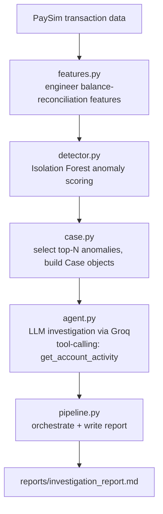

# Fraud/Transaction Anomaly Agent

An end-to-end fraud investigation system that combines unsupervised anomaly detection with an LLM agent that investigates flagged transactions and produces human-readable verdicts. Built from scratch as a learning project to explore how anomaly detection and agentic LLM reasoning combine in a real fraud-analyst workflow.

## Why this approach

Fraud detection is usually framed as supervised classification, but real fraud teams face a harder problem: confirmed fraud labels lag by weeks or months, and fraud patterns evolve faster than labeled training data can keep up. This project uses **unsupervised anomaly detection** (Isolation Forest) instead — it doesn't need fraud labels to train, only a model of what "normal" transaction behavior looks like. Flagged anomalies are then handed to an **LLM agent** that investigates each one individually, pulls additional account history if needed, and writes a plain-English verdict — closer to how a human fraud analyst actually works.

## Architecture



A key design constraint: the agent is evaluated **blind**. `Case.to_agent_context()` deliberately excludes the ground-truth fraud label — the agent only ever sees what a real analyst would see at investigation time, never the answer key.

## Tech stack

- **Python** (pandas, scikit-learn)
- **Isolation Forest** (scikit-learn) for unsupervised anomaly scoring
- **Groq API** — hosted, open-weight LLM (`openai/gpt-oss-120b`) for the investigation agent
- **PaySim** — a public, synthetic mobile-money transaction dataset with labeled fraud, used in place of real (non-public) transaction data

## Results

**Detector (Module 3), evaluated on a held-out test split:**
- Fraud rate in test set: 0.296%
- At the model's default threshold: precision 21.2%, recall 21.7%
- At the top 1% most-anomalous transactions (5,541 flagged): precision 12.7%, recall 42.8%
- Average precision (PR-AUC): 0.099

**Agent + full pipeline (Modules 7-8), evaluated on the 15 highest-anomaly-score cases:**
- Precision at HIGH-risk flags: 6.67% (1/15)
- Average investigation latency: ~9.75s/case (range 1.1s-20.9s)

These numbers are intentionally reported at face value, including where they're unflattering — see [`FINDINGS.md`](FINDINGS.md) for the full decision log behind every modeling choice, and [`reports/system_evaluation.md`](reports/system_evaluation.md) for the full evaluation writeup and responsible-AI discussion.

## Known limitations

- The agent has only been evaluated on 15 cases — far too small a sample to claim it improves on the raw anomaly score at scale.
- Those 15 cases are dominated by one repeating pattern (very large, round-number transfers), so this evaluation doesn't test how the agent handles more varied anomalies.
- At ~9.75s/case, this system cannot run in a real-time transaction-blocking path, and doesn't scale to the detector's full flagged volume without parallelization or a cheaper first-pass model.
- The underlying LLM occasionally hallucinates a call to a nonexistent tool instead of returning plain text; this is caught and recovered from (see `agent.py`), but it's a known quirk of the specific hosted model used, not something fully eliminated.
- This system should only ever produce **recommendations for a human analyst**, never autonomous account or transaction actions — see `reports/system_evaluation.md` for the full guardrails discussion.

## Project structure

```
fraud-anomaly-agent/
├── data/                   # PaySim CSV (gitignored — see Setup)
├── models/                 # trained Isolation Forest (gitignored — regenerated by detector.py)
├── notebooks/
│   └── explore.py          # initial data exploration
├── reports/
│   ├── investigation_report.md   # generated by pipeline.py
│   └── system_evaluation.md      # system-level evaluation & responsible AI discussion
├── src/
│   ├── features.py         # feature engineering
│   ├── detector.py         # trains & evaluates the Isolation Forest
│   ├── case.py              # builds Case objects from flagged transactions
│   ├── tools.py             # tool-calling functions available to the agent
│   ├── agent.py              # LLM investigation agent (Groq, tool-calling)
│   └── pipeline.py           # end-to-end orchestration + report generation
├── FINDINGS.md              # dated engineering decision log
├── requirements.txt
└── README.md
```

## Setup & running it yourself

1. Clone the repo and create a virtual environment:
```
   python -m venv venv
   venv\Scripts\activate        # Windows
   pip install -r requirements.txt
```
2. Download the [PaySim dataset](https://www.kaggle.com/datasets/ealaxi/paysim1) and place the CSV in `data/`.
3. Get a free API key from [Groq](https://console.groq.com) and create a `.env` file in the project root:
```
   GROQ_API_KEY=your_key_here
```
4. Run the pipeline, in order:
```
   python src/detector.py     # trains and saves the anomaly detector
   python src/pipeline.py     # runs the full investigation pipeline, writes reports/investigation_report.md
```

## Possible next steps

- Evaluate the agent on a larger, more diverse sample of flagged transactions
- Rebuild the agent loop using a framework like LangGraph for comparison against the current hand-rolled tool-calling loop
- Add retrieval over past investigated cases so the agent can reference similar historical decisions